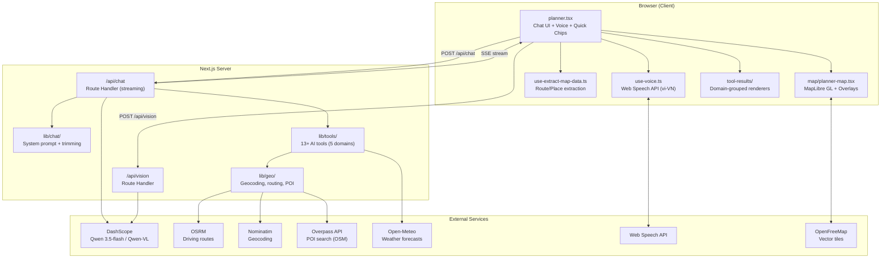
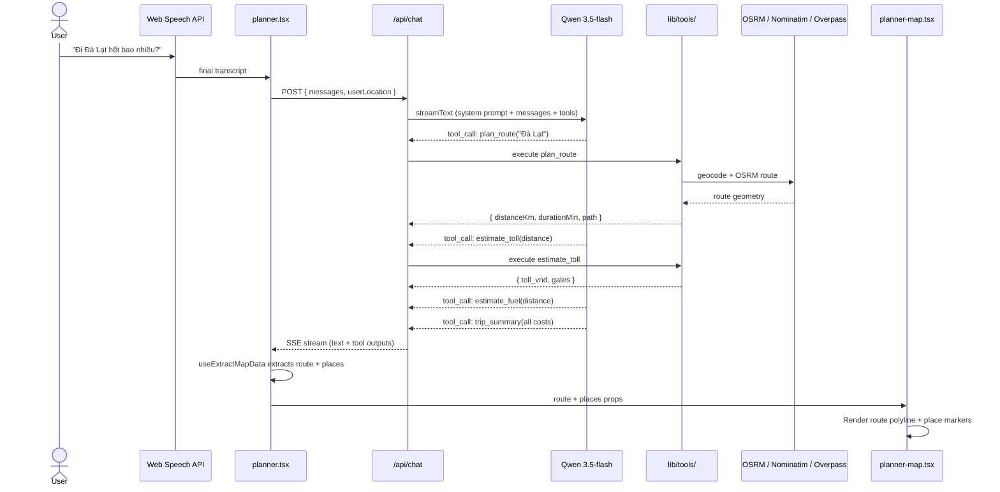
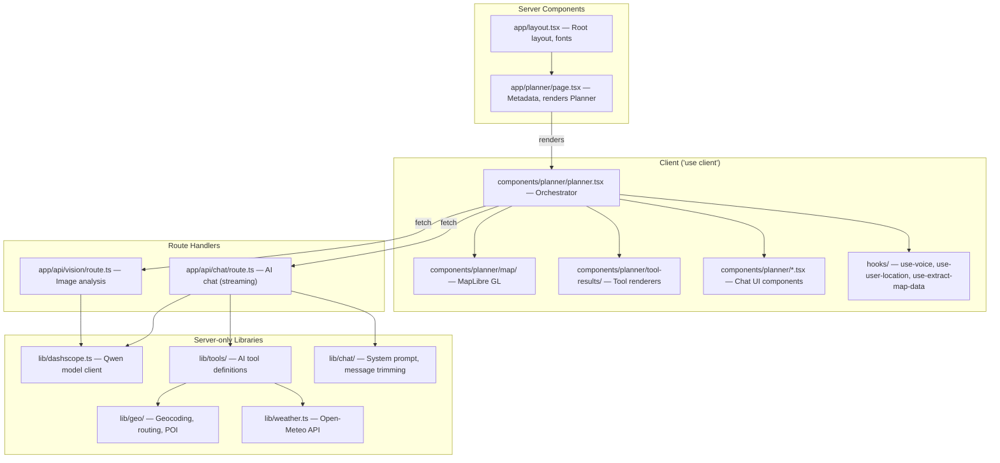

# Architecture: AI-Powered Trip Planner

VETC Buddy is a voice-first Vietnamese trip planner built for the **Qwen-VL hackathon**. It layers AI-powered experiences on top of VETC's existing toll-road payment platform.

## System Overview



---

## Data Flow

### Chat flow (tool-use streaming)



The system prompt instructs Qwen to chain tools: a route query must trigger `plan_route` -> `estimate_toll` -> `estimate_fuel` -> `trip_summary` (up to 8 tool steps per response).

### Vision flow

```
User captures photo of toll receipt
  -> POST /api/vision { image: base64 }
  -> DashScope Qwen-VL: messages with image_url content part
  -> Extracted: { tollGate, amount, licensePlate, timestamp }
  -> Client displays parsed receipt in chat
```

---

## AI Tools (13 tools, 5 domains)

Tools are defined in `src/lib/tools/` using the Vercel AI SDK `tool()` builder with Zod schemas.

| Domain | File | Tools | External APIs |
|--------|------|-------|---------------|
| **Routing** | `tools/routing.ts` | `plan_route`, `compare_routes`, `multi_stop_trip` | OSRM, Nominatim |
| **Places** | `tools/places.ts` | `search_places`, `get_nearby`, `search_along_route` | Overpass (OSM), Nominatim |
| **Costs** | `tools/costs.ts` | `estimate_toll`, `estimate_fuel`, `trip_summary` | Curated toll data |
| **Weather** | `tools/weather.ts` | `get_weather`, `weather_along_route` | Open-Meteo |
| **Misc** | `tools/misc.ts` | `check_wallet`, `analyze_image`, `web_search` | DashScope (vision), DuckDuckGo |

Shared helpers (vehicle multipliers, fuel prices, fuzzy city matching) live in `tools/helpers.ts`.

---

## Server / Client Boundary



**Rules:**
- `"use client"` only on components that need browser APIs, hooks, or event handlers. Child imports inherit the client boundary.
- All `lib/` files are server-only — no `"use client"` directive.
- API keys (`DASHSCOPE_API_KEY`) live only in server code. Never prefix with `NEXT_PUBLIC_`.

---

## Geo Module (`lib/geo/`)

Handles all geographic operations via a barrel export (`index.ts`).

| File | Responsibility | External API |
|------|---------------|--------------|
| `constants.ts` | VN_CENTER, corridor waypoints, Overpass endpoints, OSM category mappings | — |
| `math.ts` | `haversineKm`, `simplifyPath`, `computeCumulativeDistances` | — |
| `geocoding.ts` | `geocode`, `reverseGeocode`, `nearestCityName`, `buildAddress` | Nominatim |
| `routing.ts` | `route`, `buildOsrmCoords` (with Vietnam corridor waypoints) | OSRM |
| `poi.ts` | `searchPOI`, `deduplicatePlaces`, chain extraction, category detection | Overpass |
| `rest-stops.ts` | `findRestStopsAlongRoute` (batched Overpass queries along route) | Overpass |

Vietnam-specific: long-distance routes inject corridor waypoints to keep OSRM domestic (prevents routing through Laos/Cambodia). POI deduplication normalizes chain/brand names ("Highland Coffee - Q1" and "Highland Coffee - Nguyen Hue" collapse to one entry).

---

## Message Context Management

The chat endpoint (`api/chat/route.ts`) manages context size:

- Keeps last 20 messages (10 conversation turns)
- For older messages: strips `path` arrays, keeps only first 2-3 search results
- System prompt injects today's date and user's current location
- Up to 8 tool-call steps per response (`stopWhen: stepCountIs(8)`)

Logic lives in `lib/chat/system-prompt.ts` and `lib/chat/trim-messages.ts`.
