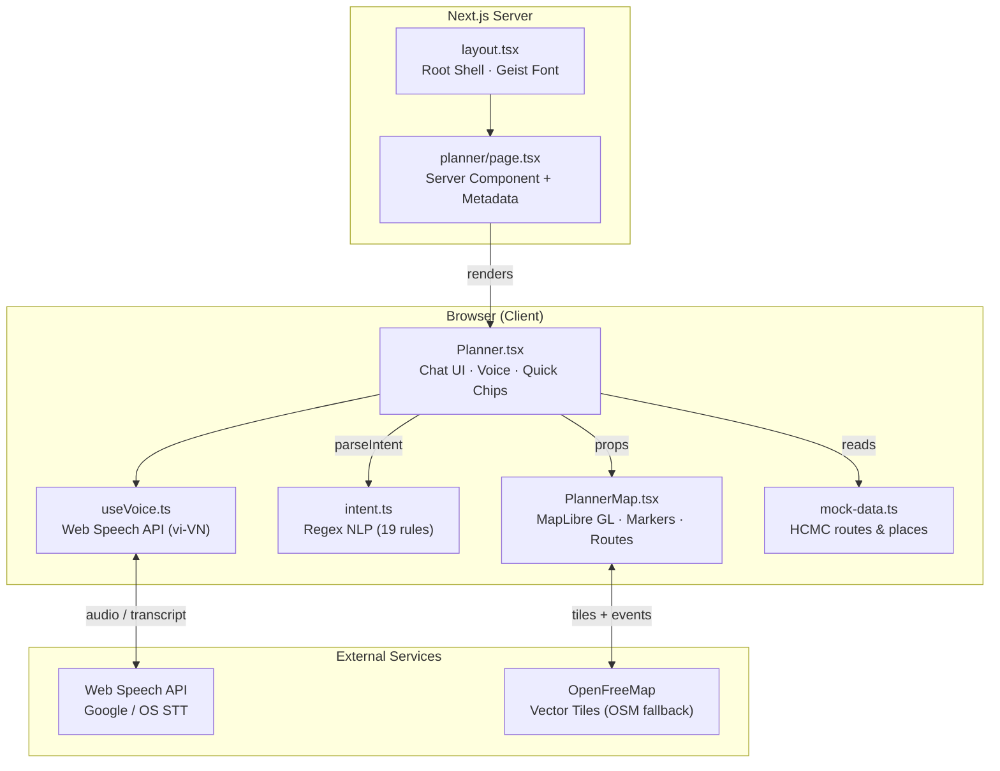
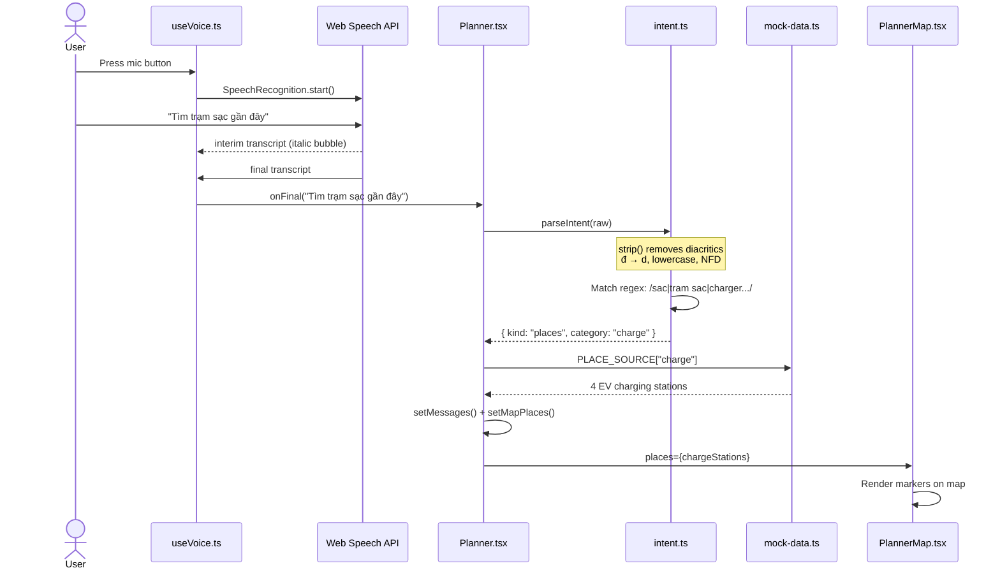
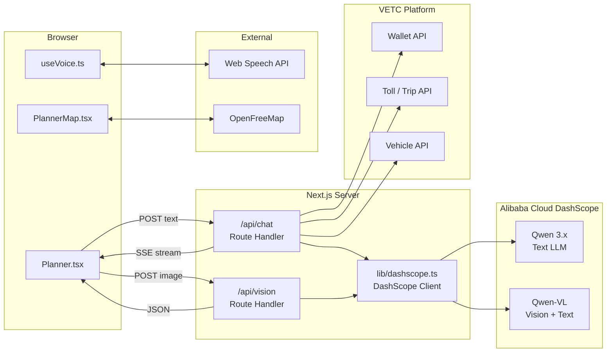
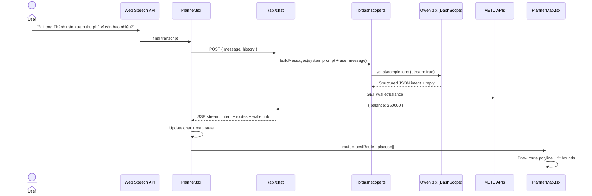
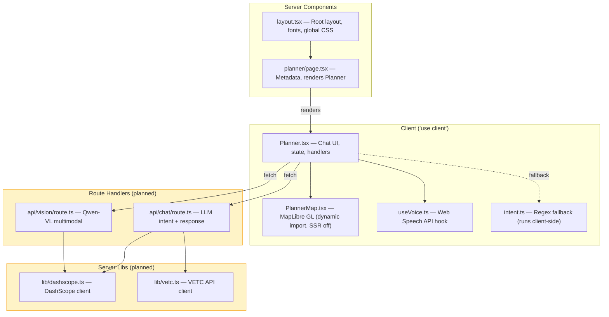

# Architecture: AI-Powered Trip Planner

VETC Buddy is a voice-first Vietnamese trip planner built for the **Qwen-VL hackathon**. It layers AI-powered experiences on top of VETC's existing toll-road payment platform. This document covers the current prototype architecture and the planned AI integration.

## System Overview



Everything currently runs **client-side** except the server component shell. No API routes, no backend calls, no secrets needed. The app works offline (minus map tiles and speech recognition).

---

## Current Data Flow (Regex Intent)

The current prototype uses regex-based Vietnamese NLP — no LLM calls.



**Key characteristic:** Zero network calls (except browser speech-to-text and map tiles). Fast, but limited to 19 hardcoded regex patterns.

---

## Intent System

`intent.ts` normalizes Vietnamese input via `strip()` (lowercase, NFD diacritic removal, `d` for `d`), then matches against rules top-to-bottom. First match wins.

### Place intents

| Category | Keywords (stripped) | Example input |
|----------|-------------------|---------------|
| EV Charging | `sac, tram sac, charger, xe dien, ev, vinfast` | "tìm trạm sạc" |
| Fuel | `xang, do xang, ron, petrol, nhien lieu` | "đổ xăng" |
| Parking | `do xe, bai xe, parking, cho dau` | "chỗ đỗ xe" |
| Insurance | `bao hiem, insurance, tnds, 2 chieu` | "mua bảo hiểm" |
| Food | `an, quan an, doi, nha hang, pho, com, bun, banh mi` | "đói bụng rồi" |

### Route preference intents

| Preference | Keywords (stripped) | Example input |
|-----------|-------------------|---------------|
| Few tolls | `tranh tram, it tram, khong phi, mien phi` | "tránh trạm thu phí" |
| Highway | `cao toc, highway, duong cao toc` | "đi cao tốc" |
| Coastal | `bien, ven bien, duong bien` | "đường ven biển" |
| Scenic | `rung, phong canh, scenic, ngam canh` | "ngắm cảnh" |
| Fastest | `nhanh, gap, voi, ket xe` | "đi nhanh nhất" |
| Cheapest | `re, tiet kiem, it tien, budget` | "tuyến tiết kiệm" |
| General route | `ve nha, toi, den, di tu, chi duong` | "chỉ đường về nhà" |

### Other intents

| Kind | Keywords (stripped) | Example input |
|------|-------------------|---------------|
| Trip plan | `ke hoach, len ke hoach, chuyen di, du lich, phuot` | "lên kế hoạch đi Đà Lạt" |
| Unknown | _(no match)_ | Fallback with help text |

Route results are scored by preference — `scoreRoute()` in `Planner.tsx` ranks mock routes by duration, toll cost, toll stops, or tag match.

---

## Planned AI Architecture (DashScope / Qwen)

The regex intent parser will be replaced with Qwen LLM calls via Alibaba Cloud DashScope. Qwen-VL adds multimodal capabilities (photo recognition).



### Key design decisions

- **Server-side only**: `DASHSCOPE_API_KEY` never reaches the browser. All LLM calls go through Route Handlers.
- **Single client module**: `src/lib/dashscope.ts` wraps DashScope's OpenAI-compatible API. All routes import from there.
- **Regional endpoint**: `dashscope-intl.aliyuncs.com` (Singapore) by default.
- **Streaming**: Route Handlers re-stream SSE from DashScope to the browser. No direct DashScope exposure.
- **Regex fallback**: `intent.ts` stays as an offline fallback when the API is unreachable.

---

## Planned Data Flow (AI-Powered)



### Multimodal flow (Qwen-VL)

```
User takes photo of toll receipt
  → POST /api/vision { image: base64 }
  → DashScope Qwen-VL: messages with image_url content part
  → Extracted data: { tollGate: "Long Thành", amount: 80000, plate: "51A-123.45" }
  → Client displays parsed receipt in chat
```

---

## Server / Client Boundary



Yellow = planned, not yet implemented.

**Rule**: API keys (`DASHSCOPE_API_KEY`, `VETC_API_KEY`) live only in server code. Never prefix with `NEXT_PUBLIC_`.

---

## Planned Module Structure

```
src/
  lib/
    dashscope.ts          # OpenAI-compatible DashScope client (fetch-based)
    vetc.ts               # VETC platform API client
  app/
    api/
      chat/route.ts       # POST — LLM intent classification + response (SSE)
      vision/route.ts     # POST — Qwen-VL multimodal (image → structured data)
    planner/
      page.tsx            # Server component (unchanged)
      Planner.tsx         # Updated: calls /api/chat instead of parseIntent()
      PlannerMap.tsx       # Unchanged
      useVoice.ts         # Unchanged
      intent.ts           # Kept as offline/fallback parser
      mock-data.ts        # Kept for demo mode
      types.ts            # Extended with AI response types
      icons.tsx           # Unchanged
```

### DashScope client pattern (from reference project)

```typescript
// src/lib/dashscope.ts — server-only
const BASE_URL = process.env.DASHSCOPE_BASE_URL
  ?? "https://dashscope-intl.aliyuncs.com/compatible-mode/v1";

export async function chatCompletion(messages: Message[], opts?: { stream?: boolean }) {
  const res = await fetch(`${BASE_URL}/chat/completions`, {
    method: "POST",
    headers: {
      "Content-Type": "application/json",
      Authorization: `Bearer ${process.env.DASHSCOPE_API_KEY}`,
    },
    body: JSON.stringify({
      model: process.env.DASHSCOPE_MODEL ?? "qwen3.5-flash",
      messages,
      stream: opts?.stream ?? false,
    }),
  });
  return res;
}
```
