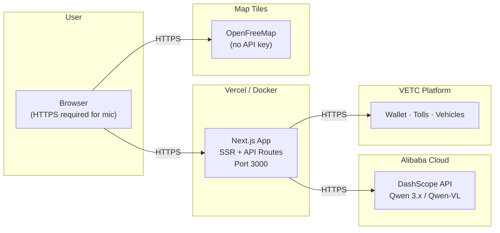
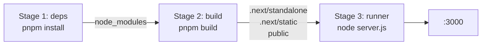

# Deployment Guide

VETC Buddy is a single Next.js application — no separate backend. API routes and SSR run in the same deployment. The app works in **mock mode** (no env vars needed) or **AI mode** (requires DashScope API key).

## Deployment Overview



**Note:** Web Speech API requires HTTPS. Local dev (`localhost`) is exempt, but any deployed URL must have a TLS certificate. Vercel provides this automatically.

---

## Environment Variables

All variables are **server-only** — none are prefixed with `NEXT_PUBLIC_`. The app runs in mock mode without any env vars set.

| Variable | Required | Default | Description |
|----------|----------|---------|-------------|
| `DASHSCOPE_API_KEY` | For AI features | _(none)_ | Alibaba Cloud DashScope API key |
| `DASHSCOPE_BASE_URL` | No | `https://dashscope-intl.aliyuncs.com/compatible-mode/v1` | DashScope API endpoint (intl = Singapore) |
| `DASHSCOPE_MODEL` | No | `qwen3.5-flash` | Default Qwen text model |
| `DASHSCOPE_VISION_MODEL` | No | `qwen-vl-max` | Qwen-VL model for image inputs |
| `VETC_API_BASE_URL` | Planned | _(none)_ | VETC platform API base URL |
| `VETC_API_KEY` | Planned | _(none)_ | VETC platform API key |

See `.env.example` in the repo root for a copy-paste template.

---

## Vercel (Recommended)

Vercel is the simplest path — zero config for Next.js + pnpm.

### Steps

1. **Push repo** to GitHub (or GitLab / Bitbucket)
2. **Import project** at [vercel.com/new](https://vercel.com/new)
3. Vercel auto-detects:
   - Framework: **Next.js**
   - Package manager: **pnpm** (from lockfile)
   - Build command: `pnpm build`
   - Output directory: `.next`
4. **Set environment variables** in Vercel dashboard → Settings → Environment Variables:
   - `DASHSCOPE_API_KEY` = your key (add to Production + Preview)
5. **Deploy** — Vercel builds and provisions HTTPS automatically

### Important notes

- HTTPS is provided automatically (required for Web Speech API)
- pnpm is auto-detected from `pnpm-lock.yaml` — no special configuration needed
- Environment variables are encrypted and only available server-side
- Preview deployments get their own URLs for each PR

---

## Docker (Alternative)

For self-hosting or non-Vercel platforms. The project does not ship a Dockerfile yet — create one as follows.

### Dockerfile

```dockerfile
FROM node:22-alpine AS base
RUN corepack enable && corepack prepare pnpm@latest --activate

# --- Dependencies ---
FROM base AS deps
WORKDIR /app
COPY package.json pnpm-lock.yaml pnpm-workspace.yaml ./
RUN pnpm install --frozen-lockfile

# --- Build ---
FROM base AS build
WORKDIR /app
COPY --from=deps /app/node_modules ./node_modules
COPY . .
RUN pnpm build

# --- Production ---
FROM base AS runner
WORKDIR /app
ENV NODE_ENV=production
ENV PORT=3000

COPY --from=build /app/.next/standalone ./
COPY --from=build /app/.next/static ./.next/static
COPY --from=build /app/public ./public

EXPOSE 3000
CMD ["node", "server.js"]
```

> **Note:** Standalone output requires `output: "standalone"` in `next.config.ts`. Add it before building the Docker image.

### Build stages



### docker-compose.yml (local dev)

```yaml
services:
  app:
    build: .
    ports:
      - "3000:3000"
    env_file: .env
    restart: unless-stopped
```

### Run

```bash
# Build and start
docker compose up --build

# Or standalone
docker build -t vetc-buddy .
docker run -p 3000:3000 --env-file .env vetc-buddy
```

---

## DashScope Setup

1. Create an [Alibaba Cloud account](https://www.alibabacloud.com/)
2. Open the [DashScope console](https://dashscope.console.aliyun.com/)
3. Create an API key under **API Keys** section
4. Enable models you need:
   - `qwen3.5-flash` — fast text model for intent classification
   - `qwen-vl-max` — vision-language model for image inputs
5. Note the regional endpoint:
   - **International (Singapore):** `https://dashscope-intl.aliyuncs.com/compatible-mode/v1`
   - **China (Beijing):** `https://dashscope.aliyuncs.com/compatible-mode/v1`
   - Default to **intl** unless deploying within mainland China
6. Set `DASHSCOPE_API_KEY` in your deployment environment

---

## Post-Deployment Checklist

- [ ] App loads at deployed URL
- [ ] `/planner` renders chat panel + map
- [ ] Voice input works (requires HTTPS)
- [ ] Quick chips trigger place/route results
- [ ] Map tiles load (OpenFreeMap — no API key needed)
- [ ] Dark mode works
- [ ] Mobile bottom-sheet panel toggles correctly
- [ ] _(After AI integration)_ `POST /api/chat` returns LLM responses
- [ ] _(After AI integration)_ `DASHSCOPE_API_KEY` is set and not leaked to client (check page source)
